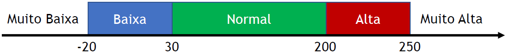

## EP2_5 - Faixas de temperatura

Foi encontrado um dispositivo que possui um sistema que mostra as seguintes  mensagens, dependendo da temperatura medida: Muito Baixa, Baixa, Normal, Alta e Muito Alta. O dispositivo usa as faixas exibidas na figura a seguir:

Escreva um programa que leia o valor da temperatura e mostre qual a mensagem que seria exibida. 

Entrada:
- Valor da temperatura.

Saída:
- Mensagem (de acordo com a temperatura).
