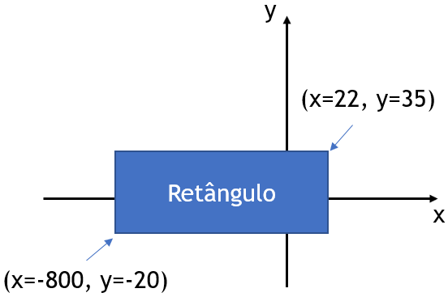

## EP2_8 - Ponto dentro do retângulo

Escreva um programa que leia os valores x e y de um ponto. A partir disso, determine se o ponto está dentro ou fora do retângulo a seguir:



Entrada:
```
x
y
```
Saída:
```
Imprima "SIM", caso o ponto esteja dentro do retângulo; ou, caso contrário, imprima "NAO" (observe que não há til no "A" do "NAO").
```
