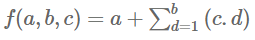

## EP3_1(função) - Valor da função

Considere a seguinte função:



Python (o arquivo submetido deve ter a extensão .py):
```py
def obter_valor_funcao(a, b, c):
    #codigo da funcao
```

Formato do caso de teste: esse é o formato dos casos de teste que aparecem ao avaliar a atividade; não inclua impressão de dados no código, essa impressão é feita automaticamente pelo sistema de correção de acordo com o retorno da função submetida.

Entrada:
- a
- b
- c

Saída:
- Valor da função (retorno da função submetida)
