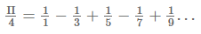

## EP3_8(função) - Valor de PI

O valor de Π pode ser calculado pela série de Gregory conforme apresentado a seguir:

_Formato do caso de teste_: esse é o formato dos casos de teste que aparecem ao avaliar a atividade; não inclua impressão de dados no código, essa impressão é feita automaticamente pelo sistema de correção de acordo com o retorno da função submetida.

Entrada:
- n

Saída:
- Valor de Π (retorno da função submetida)
