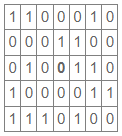

## EP5_10 - Campo minado

Escreva um programa que leia uma matriz que contém o mapa de um campo minado. Nesta matriz, o valor 1 indica que há uma bomba na célula e o valor 0 indica que não há uma bomba na célula. A matriz é composta apenas pelos valores 0 e 1. Exemplo de mapa do campo minado seguindo esse formato:



Observação: após a leitura das dimensões da matriz, os elementos de cada linha da matriz estão dispostos linha por linha. Por exemplo (as duas primeiras linhas são as dimensões da matriz: número de linhas (2) e número de colunas(3)):
```
2
3
1 0 1
0 0 1
```

_Dica para Python ou Java: a leitura dos elementos da matriz da forma descrita aqui pode ser realizada com uma estratégia similar àquela apresentada no enunciado dos dois primeiros exercícios sobre matrizes (EP5_1 e EP5_2)._

Após ler a matriz com o mapa, o programa irá ler as coordenadas de uma célula (linha e coluna) e então deverá imprimir quantas bombas há na vizinhança da célula (desconsiderando a própria célula). Por exemplo, para o mapa apresentado anteriormente, na célula (linha=2; coluna=3), há 3 bombas na vizinhança. Portanto, o programa deverá imprimir o valor 3 neste caso.

Importante: considere que os índices das linhas e colunas iniciam no zero. Portanto, a coluna 2 é a terceira coluna na matriz, assim como a linha 3 é a quarta linha na matriz.

Entrada
- Quantidade de linhas na matriz
- Quantidade de colunas na matriz
- Valores da matriz (mapa do campo minado)
- Linha da célula a ser consultada
- Coluna da célula a ser consultada

Saída
- Quantidade de bombas na vizinhança da célula
