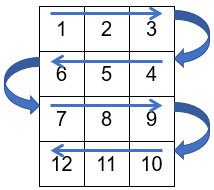

## EP5_4 - Zig-zag de números

Escreva um programa que leia as dimensões de uma matriz e então imprima uma matriz que contém uma sequência de números ordenados linha a linha formando um zig-zag. Exemplo para uma matriz com 4 linhas e 3 colunas:



Entrada:
- L (número de linhas)
- C (número de colunas)

Exemplo:
```
3
5
```

Saída:
- Matriz com dimensões L x C com os múltiplos de 10 (em cada linha impressa, há um caractere espaço entre cada número impresso)

Exemplo:
```
1 2 3 4 5
10 9 8 7 6
11 12 13 14 15
```
