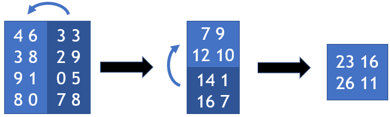

## EP5_6 - Matriz dobrada

Escreva um programa que leia uma matriz de dimensões n x n (assuma que n é par). Após isso, imprima o resultado da matriz dobrada da seguinte forma:



Para ler a matriz, primeiro será informada a dimensão n. Após isso, os elementos de cada linha da matriz estão dispostos linha por linha. Por exemplo (a primeira linha é o valor de n):
```
3
6 3 2
7 8 9
2 8 1
```

_Dica para Python ou Java: a leitura dos elementos da matriz da forma descrita aqui pode ser realizada com uma estratégia similar àquela apresentada no enunciado dos dois primeiros exercícios sobre matrizes (EP5_1 e EP5_2)._

Entrada:
- n
- Dados da matriz

Saída:
- Matriz após as dobras
