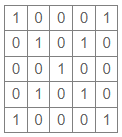

## EP5_7(função) - Matriz X

Escreva uma função/método que recebe um valor n (assuma que n é impar). A função/método deve retornar uma matriz X, formada por números 1 nas diagonais e 0 em todas as outras posições.

Por exemplo, para n=5, a função deve retornar a seguinte matriz:



Função/método a ser implementado:

Python (o arquivo submetido deve ter a extensão .py):
```
def obter_matriz_x(n):
    #codigo da funcao
```

_Importante: submeta apenas a função/método e não realize leitura de dados (input/Scanner) ou impressão de dados (print/System.out)._

Neste exercício, não é permitido utilizar:
Em Python: as funções de listas: del, append, extend, insert, remove, pop.

Formato do caso de teste: esse é o formato dos casos de teste que aparecem ao avaliar a atividade; não inclua impressão de dados no código, essa impressão é feita automaticamente pelo sistema de correção de acordo com o retorno do método submetido.

Entrada:
- n

Saída:
- retorno da função/método

Exercício adaptado de Gabriel Ângelo Sembenelli (2022).
